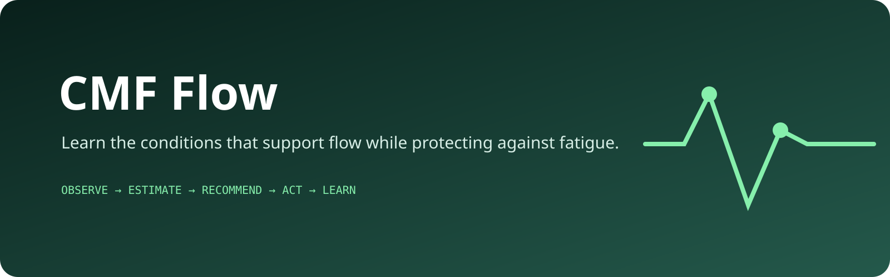

<p align="center">
  
</p>

# CMF Flow

CMF Flow is a local-first Android app that helps one person learn the conditions that support subjective flow while protecting against cumulative fatigue.

The core loop is:

`Observe → Estimate state → Recommend → Act → Check in → Learn`

## CMF Flow 1.0

The 1.0 product includes:

- A polished Material 3 Android experience with Home, Insights, Tasks, Experiments and Settings.
- One-time onboarding with optional attention-sensing setup.
- A real adaptive launcher icon and system light/dark theme support.
- 20-second subjective check-ins for flow, absorption, effortless control, enjoyment, presence and fatigue.
- Health Connect context from the CMF Watch Pro 2 / Nothing X path, including confirmed heart rate, sleep, steps and SpO₂ export.
- Privacy-preserving attention context using aggregate app-switch, unlock, screen-transition and notification counts. Notification text and app-switch history are not persisted.
- State-aware task ranking using value, urgency, difficulty fit, fatigue guardrails and bounded personalized evidence.
- A session-aware intervention policy that can recommend continuing, switching, simplifying, asking AI for help, taking a break, exercising, stopping or reducing interruptions.
- Feedback and outcome learning from recommendation acceptance/rejection and subsequent check-ins.
- Balanced randomized N-of-1 experiments. One trial is active at a time, the next check-in records its outcome, and comparison results remain hidden until minimum evidence thresholds are met.
- Optional check-in reminders.
- Local Room persistence with non-destructive migrations.
- Android backup disabled so the app database is not included in normal app backup flows.

## Privacy model

CMF Flow is designed for personal, local-first use.

- No cloud account is required.
- Health Connect data is read locally.
- Notification content is never stored.
- Raw app/package transition history is not persisted.
- Android app backup is disabled.
- Data is protected by the Android application sandbox and the device's storage protections. The current database is **not** independently SQLCipher-encrypted, so the project does not claim application-level database encryption.

See [`PRIVACY.md`](PRIVACY.md) for the full data-handling description.

## Hardware path

The supported product path is:

- **Android phone:** compute, storage, UI, task planning, reminders and local learning.
- **CMF Watch Pro 2:** health context through Nothing X → Health Connect.

Real-device validation has confirmed Nothing X origin package `com.nothing.smartcenter` for the supported exported signals. Direct BLE/Gadgetbridge ingestion is not required for the 1.0 product and is reserved for possible future vendor-only metrics or lower-latency research.

The remaining hardware-only checks are tracked in GitHub issue #1 and do not block the software release candidate.

## Development

Requirements:

- JDK 17
- Android SDK 36
- Gradle 8.13

CI runs Android lint, unit tests and a debug APK build on every push to `main` and on pull requests.

```bash
gradle --no-daemon :app:lintDebug :app:testDebugUnitTest :app:assembleDebug
```

## Design principles

- Optimize for subjective flow, not maximum activity or screen time.
- Treat physiological data as noisy context, not medical truth.
- Protect long-term performance and fatigue guardrails before optimizing short-term output.
- Allow “do nothing” or “stop” to be valid recommendations.
- Treat rejected recommendations as useful feedback.
- Use association language unless an experiment supports a stronger causal interpretation.
- Require minimum evidence before personalization can change behavior.

## Status

**1.0.0 release candidate.** Software completeness is gated by CI; the only open repository issue is explicitly hardware-validation-only.
